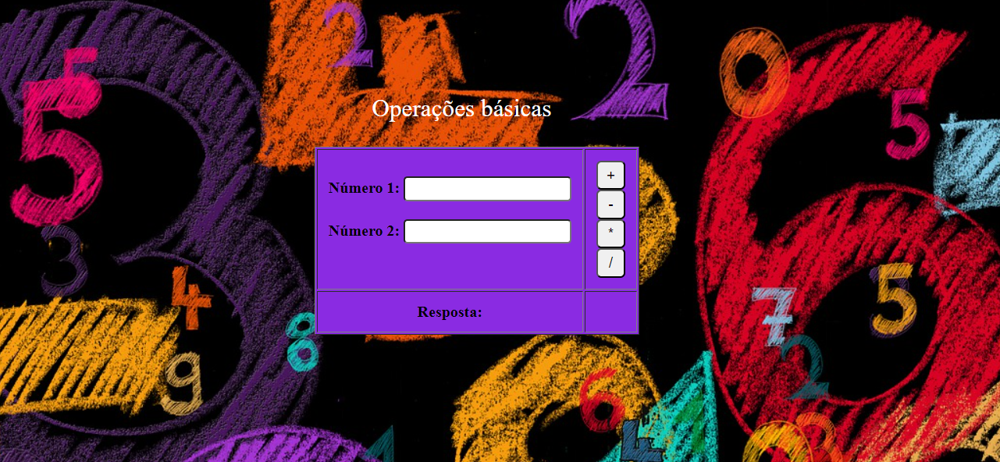
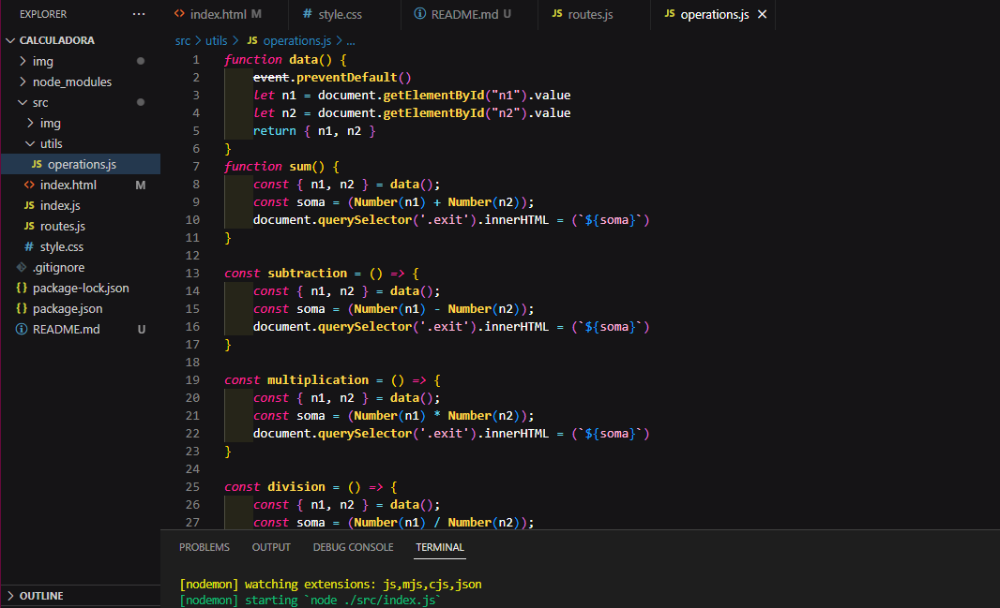

# Calculadora

O projeto é uma aplicação front-end com back-end, para desenvolver uma calculadora com as 4 operações báscias no servidor. Na parte do front-end utilizei o HTML, CSS e JavaScript, já na parte do back-end utilizei JavaScript, o framework Express.js e o Node.js.

### Front-end do servidor


### Como rodar:

1º Baixar o projeto ou dar um git clone;
<br>
2º No terminal digitar 'npm install';
<br>
3º Depois digitar 'npm run start'
<br>
4º Abrir no servidor com a rota 'http://localhost:4000/'

```javascript
Após iniciar o servidor, será exibido uma tela, aí só digitar os números e escolher a operação que deseja realizar com eles.
```
### Código das operações:


### Tecnologias utilizadas:
<div>
  
  
  
  </div>
